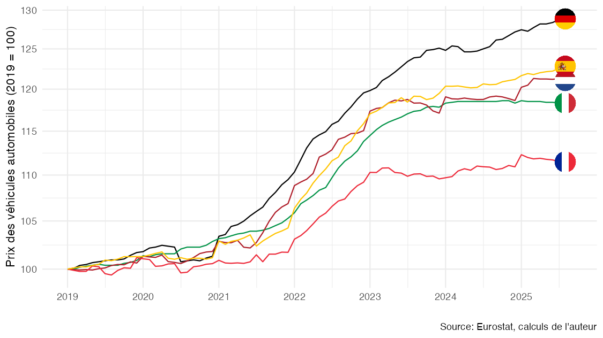
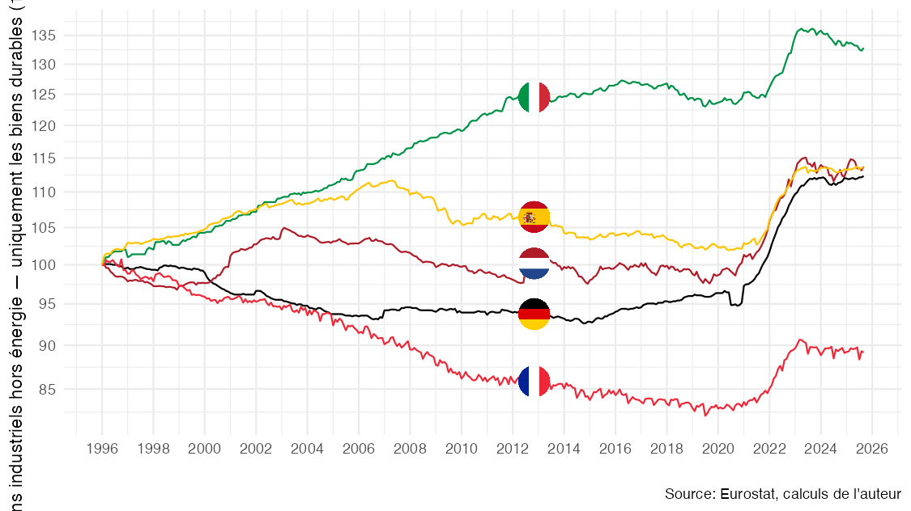

# Effets qualité, mesure de l'inflation et transition écologique

Le rapport thématique "Inflation" du rapport Pisani, Mahfouz (2023):

- Dees S., E. Bellevrat, de A. Gaye, F. Geerolf, M. Lequien, R. Schweizer, A. Tettaravou et O. Wegner, 2023, « Les incidences économiques de l'action pour le climat : rapport thématique inflation », France stratégie, mai 2023. [[pdf](https://www.strategie-plan.gouv.fr/files/files/Publications/Rapport/fs-2023-les_incidences_economiques_de_laction_pour_le_climat-thematique-inflation.pdf)] [[html](https://fgeerolf.com/effets-qualite-PisaniMahfouz2023.html)]

Le rapport Pisani, Mahfouz (2023):

- Pisani-Ferry J., S. Mahfouz, 2023, « Les implications économiques de l’action climatique », novembre 2023, France stratégie. [[pdf](https://www.strategie-plan.gouv.fr/files/files/Publications/Rapport/2023-incidences-economiques-rapport-pisani-5juin.pdf)]

## Figure 1: Véhicules automobiles

### 1996-

[Code R](figure1.R)

### 2019-

[Code R](figure1b.R)

## Figure 1n: Véhicules automobiles neufs

### 2019-

[Code R](figure1nb.R)

## Figure 2: Biens industriels hors énergie — uniquement les biens durables

### 1996-

[Code R](figure2.R)

### 2019-

[Code R](figure2b.R)

