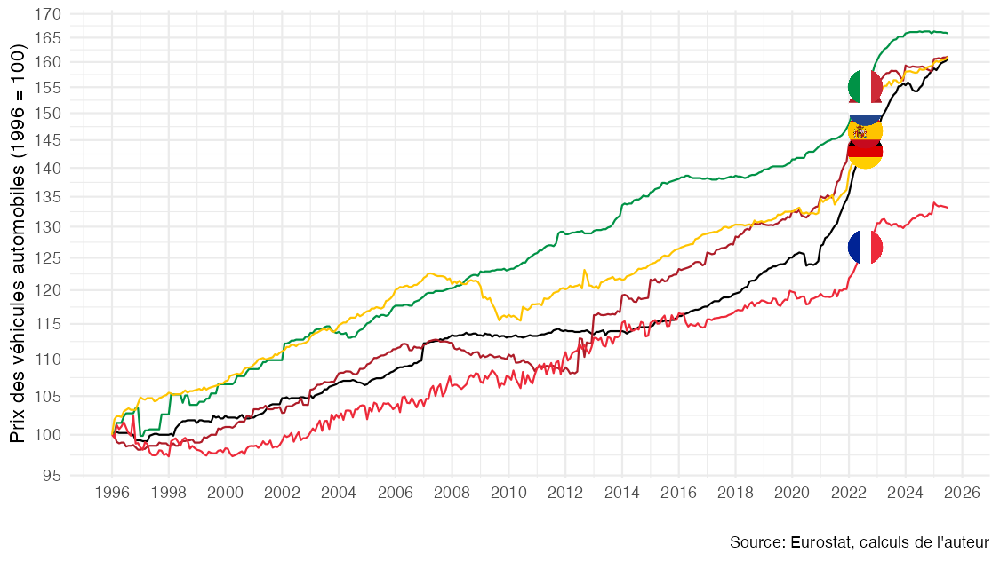

# Effets qualité et transition écologique

Dans le rapport Pisani, Mahfouz (2023):

- Dees S., E. Bellevrat, de A. Gaye, F. Geerolf, M. Lequien, R. Schweizer, A. Tettaravou et O. Wegner, 2023, « Les incidences économiques de l'action pour le climat : rapport thématique inflation », France stratégie, mai 2023. [[pdf](https://www.strategie-plan.gouv.fr/files/files/Publications/Rapport/fs-2023-les_incidences_economiques_de_laction_pour_le_climat-thematique-inflation.pdf)]

- Pisani-Ferry J., S. Mahfouz, 2023, « Les implications économiques de l’action climatique », novembre 2023, France stratégie. [[pdf](https://www.strategie-plan.gouv.fr/files/files/Publications/Rapport/2023-incidences-economiques-rapport-pisani-5juin.pdf)]

## Graphique 1: Véhicules automobiles

[Code R](figure1.R)

